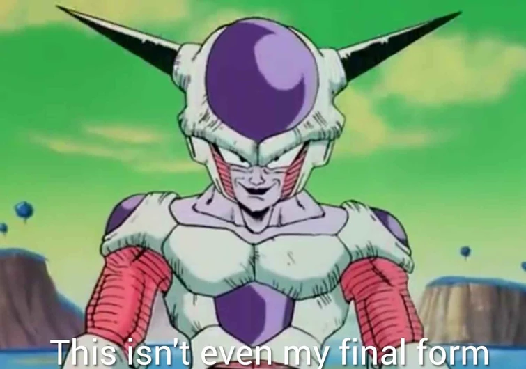

# 🚀  RoSE Terrain Generator (RTG) 🌔 

This script uses of the **Depth Anything V2** package to produce 3D meshes from depth maps from 2D images as input. The resulting meshes can be used in various simulation platforms, such as **Isaac Sim** and **Gazebo**.

<details>
  <summary><b>Usage in Isaac Sim & Gazebo (Example Images)</b></summary>
  <br>

  <p><strong>Isaac Sim with Robot:</strong></p>
  
  
  <p><strong>Isaac Sim:</strong></p>
  

  <p><strong>Gazebo:</strong></p>
  
</details>

## :brain: Motivation
While there are plenty of DEM simulation options for lunar (and, in some cases, Martian) environments, as space robotics enthusiasts, we're also interested in exploring the terrains of other planets and exoplanets. This monocular depth-based estimation provides an easy way to generate terrain meshes for advanced simulations, using just 2D images to fill in the gaps where DEM resources are lacking for unexplored terrains.


## ⚡️ Installation & Setup

### 1. Clone the Depth-Anything V2 repository
To begin, you need to clone the **Depth-Anything V2** repository from GitHub:

```bash
git clone https://github.com/DepthAnything/Depth-Anything-V2.git
cd Depth-Anything-V2
```
Store the model weights you want to use (I used the base model weights) into a folder named **"checkpoints"** in the root folder.
[Further Instructions: Depth-Anything-V2 GitHub](https://github.com/DepthAnything/Depth-Anything-V2/tree/main)

### 2. Install dependencies
Run the requirements.txt file to install dependencies from the root folder

```bash
pip install -r requirements.txt

```
Additionally install open3D
```bash
pip install open3d

```
### 3. Place the rtg.py script in the root folder

Copy the rtg.py file from RTG into the root folder of the **Depth-Anything-V2** package

### 4. Set Image Path and Max Depth
The script allows you to configure the input image path and the maximum depth value (more the depth, bigger the mesh).

Open the script rtg.py and update the following configuration variables in the CONFIG section (I am using basic):
```
CONFIG = {
    # select the model
    'encoder': 'vitb',  
    # load pretrained weights
    'load_from': 'Depth-Anything-V2/checkpoints/depth_anything_v2_vitb.pth',
    'max_depth': 200,  # Adjust max depth to scale the mesh size (larger depth = bigger mesh)
    'img_path': 'path_to_your_image.png',  # Set the path to the image you want to process
    #output directory where you want to store mesh data
    'outdir': './vis_pointcloud',
    # these may require some trial and error
    'focal_length_x': 470.4,
    'focal_length_y': 470.4,
    'save_formats': ['ply', 'pcd', 'xyz'],  # Multiple formats for compatibility
    'remove_outliers': True,  # Option to remove noisy points
    'voxel_size': 0.006  # For downsampling dense areas
}

```
### 5. Run the script
Once the configuration is set, run the script to generate the depth map, point cloud, and mesh:

```bash
python rtg.py

```
The generated mesh will be saved in the specified outdir in multiple formats like .ply, .pcd, and .xyz, and also as an .obj mesh.

## 🛠️ Usage in Simulation Environments

### 1. Isaac Sim
The generated .obj mesh can be directly imported into Isaac Sim for use in simulation. Set **Z-axis up** while importing the mesh file. You might need to adjust the orientation and scale of the mesh file as needed.

### 2. Gazebo
If you are using Gazebo, you may need to convert the mesh from **.ply** to **.dae (Collada)** format.

### 2.1 Conversion Instructions (Using MeshLab)
To convert the .obj file into .dae, follow these steps:

1. **Install MeshLab:**
```bash
sudo apt update
sudo apt install meshlab
```
2. **Open Meshlab**

3. **Import the .ply mesh file (the one with "mesh" written in the file name):**

- Go to File > Import Mesh (Ctrl+I) and select the generated .ply file.
4. **Apply texture parametrization:**

- Go to Filters > Texture > Parametrization: Trivial Per-Triangle.
- If you see the warning "Inter-Triangle border is too much", increase the Texture Dimension (px).

5. **Transfer vertex attributes:**

- Go to Filters > Texture > Transfer Vertex Attributes to Texture (between 2 meshes).
- Check Assign Texture and Fill Texture.
6. **Export as Collada file (.dae):**

- Go to File > Export Mesh As....
- Select Collada File Format (*.dae).
- Make sure to check TexCoord.

🎉 After the conversion, you can import the .dae file into Gazebo🎉

## 👎 Limitations
- Purely monocular depth-based terrains can be inaccurate, might need some manual scaling 
- Work in progress:



## :raised_hands: Acknowledgements

- Thanks to Lihe Yang and the team for coming up with Depth-Anything-V2
- Thanks to the user, Iker Lluvia for documenting meshlab coversion process [here](https://github.com/ethz-asl/voxblox_ground_truth/issues/13)
